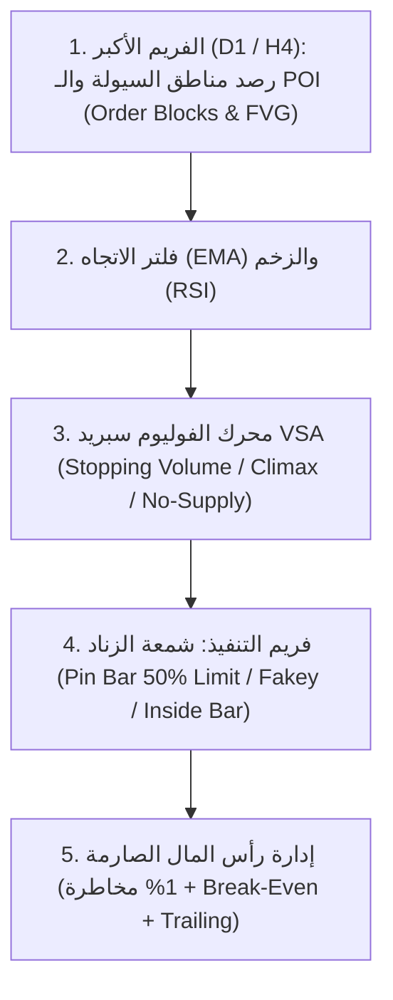

# 📊 دليل النظام المؤسسي المتكامل على MT5 (Price Action + POI + VSA v2.0)

تمت ترقية الإكسبرت إلى الإصدار **v2.0 الكامل**، والذي يدمج الآن جميع محاور استراتيجيتك الأصلية مع قواعد كتاب **Price Action Trading (الـ 97 صفحة)** في منظومة خوارزمية موحدة.

---

## 🏛️ البنية الهندسية للنظام المدمج (4 طبقات متكاملة)

---

## 🆕 الإضافات الكبرى في الإصدار v2.0

### 1. محرك الـ POI المتعدد الفريمات (Multi-Timeframe Points of Interest):
* يقوم الإكسبرت بمسح فريم الـ **Daily (D1)** أو **H4** تلقائياً.
* يستخرج مناطق الطلب والعرض الحقيقية (**Bullish / Bearish Order Blocks**) التي أحدثت انفجاراً سعرياً وفجوة سيولة (**Fair Value Gap / Imbalance** أكبر من 1.2 ATR).
* **يرسم مربعات ملونة حية على الشارت (أخضر للطلب، أحمر للعرض)**، ويمددها للأمام ويحذفها تلقائياً عند كسرها (Mitigation).
* **القاعدة الصارمة:** الإكسبرت لا يفتح صفقة شراء إلا إذا كان السعر يلامس منطقة طلب من الفريم الأكبر، ولا يبيع إلا عند منطقة عرض.

### 2. محرك الفوليوم سبريد (VSA - Volume Spread Analysis):
* **فوليوم الإيقاف والذروة (Stopping & Climactic Volume):** التأكد من أن شمعة الانعكاس (البين بار أو الفايكي) شهدت فوليوم أكبر بـ **1.6 إلى 2.0 ضعف** من المتوسط، وهو الدليل الرقمي على امتصاص صناع السوق للستوبات.
* **اختبار جفاف السيولة (No-Supply / No-Demand Test):** التأكد من أن اختبار المنطقة تم بفوليوم منخفض جداً يؤكد غياب البائعين قبل الشراء.

### 3. تقنية دخول الـ 50% Limit Entry (المأخوذة من صفحة 62 بالـ PDF):
* بدلاً من الشراء عند إغلاق البين بار بوقف كبير، يضع الإكسبرت أمر `Buy Limit` أو `Sell Limit` عند **منتصف شمعة البين بار تماماً**.
* هذا يقلص وقف الخسارة للنصف، ويرفع نسبة الربح إلى المخاطرة (R:R) إلى **$1:3$ و $1:5$** تلقائياً.

---

## ⚙️ جدول الإعدادات والتحكم في الإكسبرت (Inputs)

| البارامتر | القيمة المقترحة | الشرح والوظيفة |
| :--- | :--- | :--- |
| `InpUseHTF_POI` | `true` | تفعيل فحص مناطق الطلب والعرض من الفريم الأكبر. |
| `InpPOITimeframe` | `PERIOD_D1` | فريم مناطق الـ POI (يمكن اختيار Daily أو H4). |
| `InpMinImbalanceAtr` | `1.2` | قوة الانفجار السعري المطلوب لتأكيد أن المنطقة صانع سوق. |
| `InpVsaMode` | `VSA_FULL_ENGINE` | نمط الـ VSA: إما تطلب فوليوم ذروة فقط، أو اختبار جفاف، أو تعطيل. |
| `InpPinEntryMode` | `ENTRY_LIMIT_50_RETRACE`| دخول البين بار: إما 50% ليميت (صفحة 62) أو ماركت مباشر. |
| `InpPinMinWickRatio` | `0.667` | شرط ذيل البين بار (2/3 من طول الشمعة كما في صفحة 55). |
| `InpRiskPercent` | `1.0%` | نسبة المخاطرة للصفقة (حساب اللوت آلياً من الرصيد). |
| `InpRiskRewardRatio`| `2.5` إلى `3.0` | نسبة الهدف إلى الوقف لكل صفقة. |
| `InpUseBreakEven` | `true` | نقل الوقف لنقطة الدخول فور وصول الربح إلى 1R. |

---

## 🧪 خطوات تشغيل الباك تيست على MT5:

1. افتح **MetaEditor (F4)** واضغط **Compile (F7)** على ملف `PriceAction_Pro_MT5.mq5`.
2. افتح الـ **Strategy Tester (Ctrl + R)** في MT5.
3. اضبط الإعدادات:
   * **Symbol:** `EURUSD` أو `GBPUSD` أو `XAUUSD` (الذهب).
   * **Timeframe:** اختر **H1** أو **M15** كفريم تنفيذ (Execution Timeframe)، وسيقوم الإكسبرت تلقائياً بقراءة مناطق الـ POI من فريم الـ **Daily (D1)** وفلترة الاتجاه من **H4**!
   * **Model:** اختر **"Every tick based on real ticks"** لاختبار صفقات الـ Limit وإدارة الـ VSA بأعلى دقة.
   * **Visual mode:** ضع علامة صح لمشاهدة المربعات الملونة لمناطق الطلب والعرض وهي تُبنى والأسهم تنفذ الصفقات مباشرة أمام عينك.
